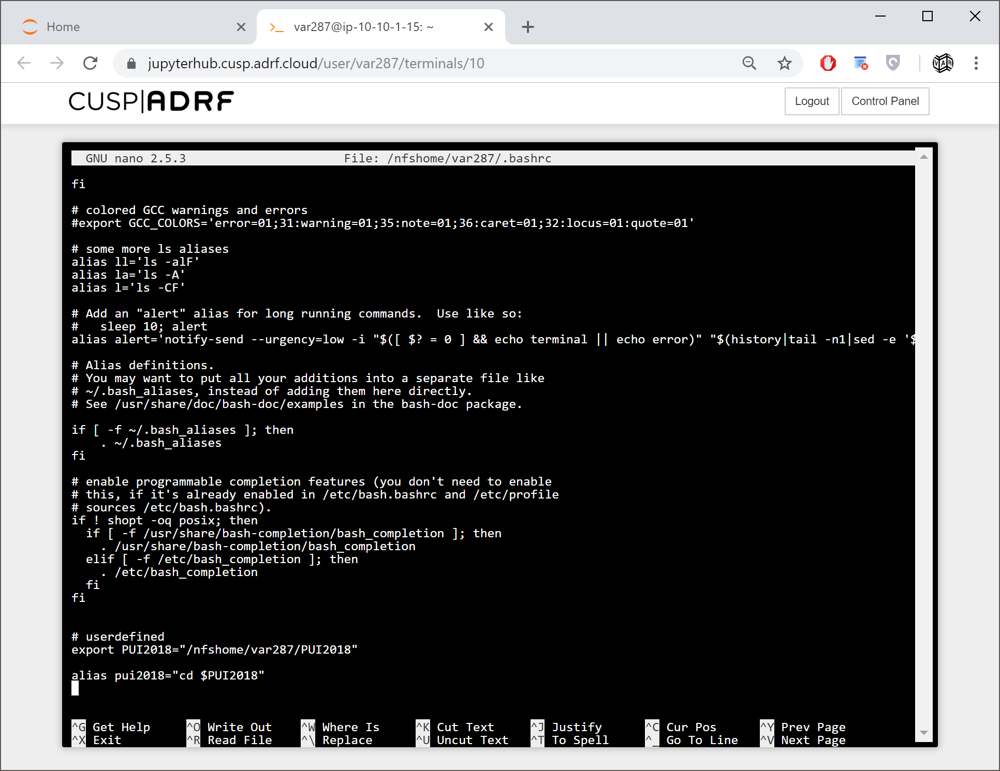
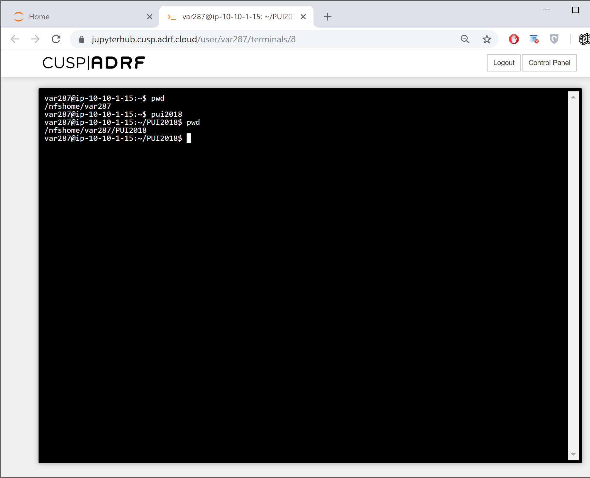

# HW 1

In homework one, we had to create an environment variable specific for PUI2018 that can be executed using alias pui2018. To do so, we have to create a new folder for PUI2018, then open our .bashrc file using nano and create the environment variable by adding the code below to the script:

```
export PUI2018="/nfshome/var287/PUI2018"
```

and create alias by adding the code:

```
alias pui2018="cd $PUI2018"
```

The .bashrc file will look like this: </br>




The final step is to check whether the alias work </br>


