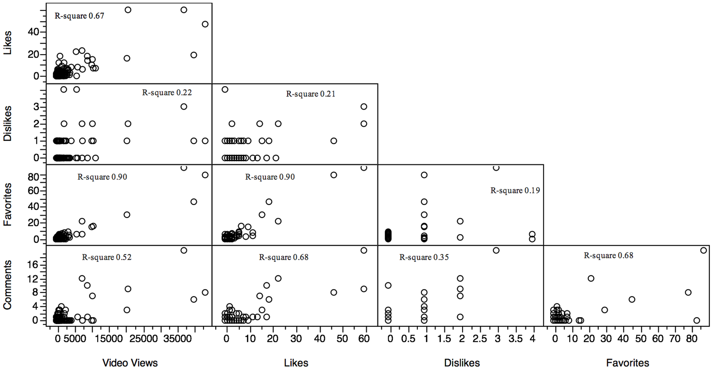

# HW 6 
Vivaldi Rinaldi

### Assignment 1
Hypothesis and data review and comments on WZ1405's HW 4 Assignment 2 

### Assignment 2
For Assignment 2, I worked with Fekade Brooks. I did Anova and Logistic Regression while Fekade did Correlation.

| Statistical Analysis | IV(s)                                                                                                                                                                        | IV type(s)              | DV(s)                                             | DV type(s)           | Control Var type | Question to be answered                                                                                              | *H0*                                                                      | alpha                                   | Link                                                                              |
|----------------------|------------------------------------------------------------------------------------------------------------------------------------------------------------------------------|-------------------------|---------------------------------------------------|----------------------|------------------|----------------------------------------------------------------------------------------------------------------------|---------------------------------------------------------------------------|-----------------------------------------|-----------------------------------------------------------------------------------|
| ANOVA                | Video Source Credibility                                                                                                                                                     | Categorical             | User Engagement: Views, Likes, Dislikes, Comments | Categorical (Counts) | None             | Do Credible Medical Videos have higher educational value in terms of user engagement than non credible medical video | Credible Medical Video <= Not Credible Medical Video                      | 0.01                                    | [Link](https://journals.plos.org/plosone/article?id=10.1371/journal.pone.0082469) |
| Correlation          |                                                                                                                                                                              |                         |                                                   |                      |                  |                                                                                                                      |                                                                           |                                         |                                                                                   |
| Logistic Regression  | Slope, Elevation, Aspect, Curvature, Topographic Wetness, Distance to faultlines, Distance to coastline, Soil, Distance to Road, Distance to Urban Areas, X and Y Coordinate | Continuous, Categorical | Agricultural Quality                              | Categorical (Binary) | None             | Isolate Predictors to determine agricultural quality                                                                 | Predictor variable have little or no impact on the agricultural quality   | Doesn't exactly state but assuming 0.05 | [Link](https://journals.plos.org/plosone/article?id=10.1371/journal.pone.0192039) |

  

Figure 1. Result figure for Anova 

 

   

Figure 2. Result figure for Logistic Regression

